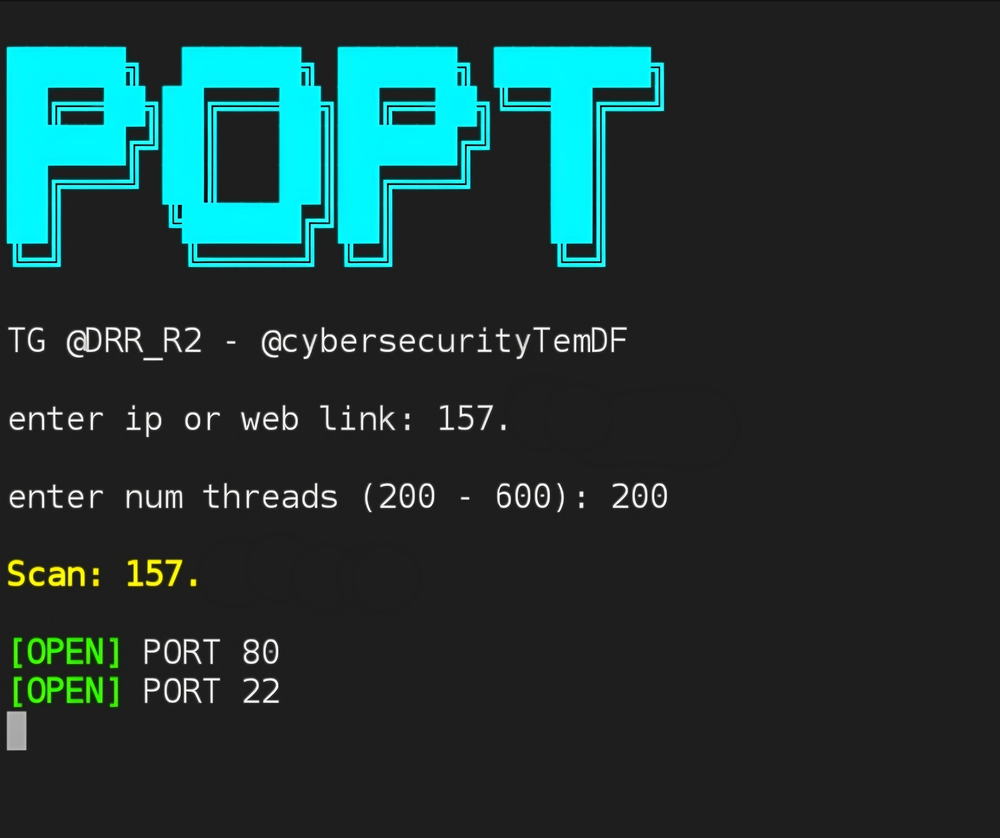

ماسح بورتات TCP سريع ومختصر بلغة Bash

فكرة المشروع

POPT يسوي سكان للبورتات باستخدام عدد محدد من الثريدات حتى يعجل الفحص ويقلل الانتظار
يطلب منك تدخل IP او رابط ويحدد عدد الثريدات وبعدها يبدي يكتشف البورتات المفتوحة من 1 لغاية 8000

طريقة التشغيل
```
git clone https://github.com/Hmza1112617/POPT.git
cd POPT
chmod +x popt.sh
bash popt.sh
```
شرح الاستخدام

1- تدخل IP او رابط السيرفر


2- تحدد عدد الثريدات (200 إلى 600)


3- البرنامج يبدي يمسح البورتات ويطبعلك المفتوحة


مثال عملي

enter ip or web link: 192.168.1.1
enter num threads (200 - 600): 400

Scan: 192.168.1.1

[OPEN] PORT 22
[OPEN] PORT 80
...
THE END.

ملاحظة

عدد الثريدات العالي ممكن يسبب حمل ثقيل على الشبكة

يستخدم timeout لكل محاولة بمدة 15 ثانية فقط حتى مايتعلك السكربت


تواصل ويانه في تيلرجام

قناة @DRR_R2

تيم @cybersecurityTemDF


